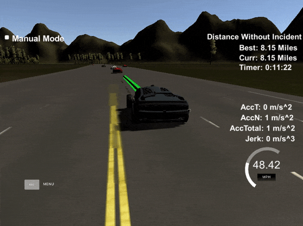

# Path Planning
 
For this project, the first goal is to get the car driving forward in its lane.

Then after this is happening succesfully, we move onto a way of detecting vehicles ahead of it and slowing down and changing lanes where appropriate to continue along the road safely and quickly.

To get the car moving along in its lane smoothly, I calculate a few sparse waypoints ahead of it along its lane using the map Frenet 's' and 'd' co-ordinates, and the supplied getXY function to convert these back into world co-ordinates. I then use the spline.h library to create a spline along these sparse waypoints, and interpolate points along this spline to add to the path so that the car travels at the needed speed.

So first, I generate two waypoints: The first is where the car was previously, and the second is where the car is right now. The way I calculate the previous point is simply looking at the car's yaw and moving one unit back from the car's position that way. This helps with the smoothness of the path, by starting the path off with the car's current position and heading. You can see this in lines 260 onwards in main.cpp. And if the simulator gives previous waypoints back from the update, then I start by using two points from this instead.

Then I calculate three more sparse waypoints ahead of the car, from the map waypoints, using Frenet 's' and 'd' co-ordinates. I calculate s+60, s+80, and s+90, meaning the car's current position along the road plus 60 meters, etc. I use the car's current lane (either 0, 1, or 2), to calculate the 'd' element of the Frenet co-ordinate. These are also converted to world X, Y co-ordinates.

```
 next_waypoint = getXY(car_s+60, (2+4*current_lane),
    map_waypoints_s, map_waypoints_x, map_waypoints_y);
```

I then add these five waypoints to our spline, as shown on line 325 in main.cpp. But before doing so, I translate and rotate them so that the point where the car is is x=0, and the car's current heading means that increasing x results in y=0 to go straight ahead, i.e. rotate so that the angle 0 means head straight ahead. This helps with making the splines have a unique x point for each y value.

To make the car's travels smooth, I load up the new path with what was leftover from the calculated path previously.

Then comes the fun part with splines. I pick a point out 30 meters ahead of the car, and calculate the spline's y value for that point. Then I calculate the direct distance to that x, y point from the 0, 0 car's position. Then I chop up that distance with 'n' points, where is calculated so that given that the simulator waits 0.02 seconds between positioning the car at each point, we're travelling at our target speed, converting from miles per hour to meters per second.

```
  double n = horizon_distance / 
              (0.02 * current_speed_factor * 49.0/2.24);
```

Then I simply calcuate the spline's y values for each of the x values along that path.

I make sure to convert them back from vehicle co-ordinates back to world x, y co-ordinates, and then add them onto the end of the planned path.

This results in the car following the lane, but still hitting anything in front of it, and still accelerating too fast.

So, the next step is to slowly speed up when starting, so that we have a smooth ride with no jerks.

To do that, we define two variables, `target_speed_factor`, and `current_speed_factor`.

```
  // How fast should we be going as factor of speed limit?
  double target_speed_factor = 1.0;
  double current_speed_factor = 0.1;
```

We start out with wanting to go as fast as we're allowed to, which is a factor of 1.0.

But we also start out going very slowly, only 10% full speed, at 0.1.

And we have a couple of simple update equations to regulate our current speed:

```
	// If our speed is too slow, speed up
	if(current_speed_factor < target_speed_factor) {
	  current_speed_factor += 0.01;
	}
	
	// If our speed is too fast, slow down
	else if(current_speed_factor > target_speed_factor) {
	  current_speed_factor -= 0.01;
	}
```

That way, we can change `target_speed_factor` and the car will slowly adjust its speed with smooth acceleration and low jerk to reach that speed.

So now we have a smooth start, but we're still not detecting other cars and avoiding them or planning our path. So, the next step is to see when a car is coming up too close to us ahead of us in our lane.

To do this, we check the `sensor_fusion` given back to us from the simulator, for cars in our lane:

```
    for(int i = 0; i < sensor_fusion.size(); i++) {
      double other_car_s = sensor_fusion[i][5]; // 5 is frenet 's' value
      double other_car_d = sensor_fusion[i][6]; // 6 is frenet 'd' value
      double our_car_d = 2 + 4 * current_lane;

      // Is the other car within our lane?
      if(other_car_d > our_car_d - 2 && other_car_d < our_car_d + 2) {

        // Check the car's s position, is it too close up front?
        if(other_car_s > car_s && other_car_s < car_s + 40.0) {

          // Slow down
          target_speed_factor = 0.5;
```

So first thing we do when we see another car ahead of us is slow down to half speed. This helps with not hitting the slow car ahead of us.

Then we consider changing lanes. The logic here is pretty simple. Depending on which lane we're in, we check the available lanes to us. There are three lanes: If left, then we check right, if middle, then we check left and right, and if right, we check left.

```
    // Check left and right lanes, make sure nothing is in the lane
    bool car = check_lane(0, car_s, sensor_fusion);
    if(!car){
      current_lane = 0;
    }
```

This simple path planning approach works surprisingly well, if there is a car in the lane where we want to change into, we simply hang back and a speed between half and full behind the slow car, and when a lane is available to change into, we change into it. 

I've also added an additional safety measure, where if the car ahead of us is less than 20m ahead of us, then we slow down to 20% speed. This helps when cars have cut us off and jumped in front of our car and other unexpected situations, so slow right down when a car is very close ahead of us.

You can see the lane changing in action here.



The car has completed two laps of the track using this method, with a total distance with no incident of over 8 miles.

The path planning approach does sometimes get stuck in situations where it is boxed in behind a car in front and to the side of it, where it could be more intellegent and slow down and go around the offending vehicles. It could also choose the lane with the most clear space ahead of it, instead of just any available lane. This is a project for another day.
